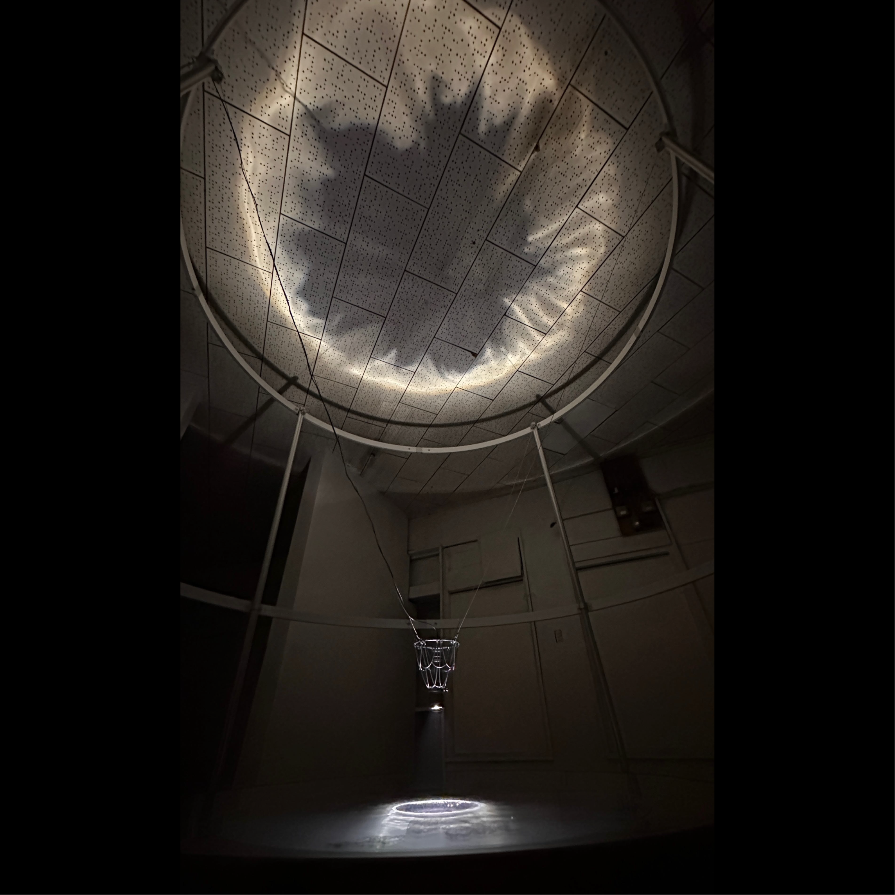
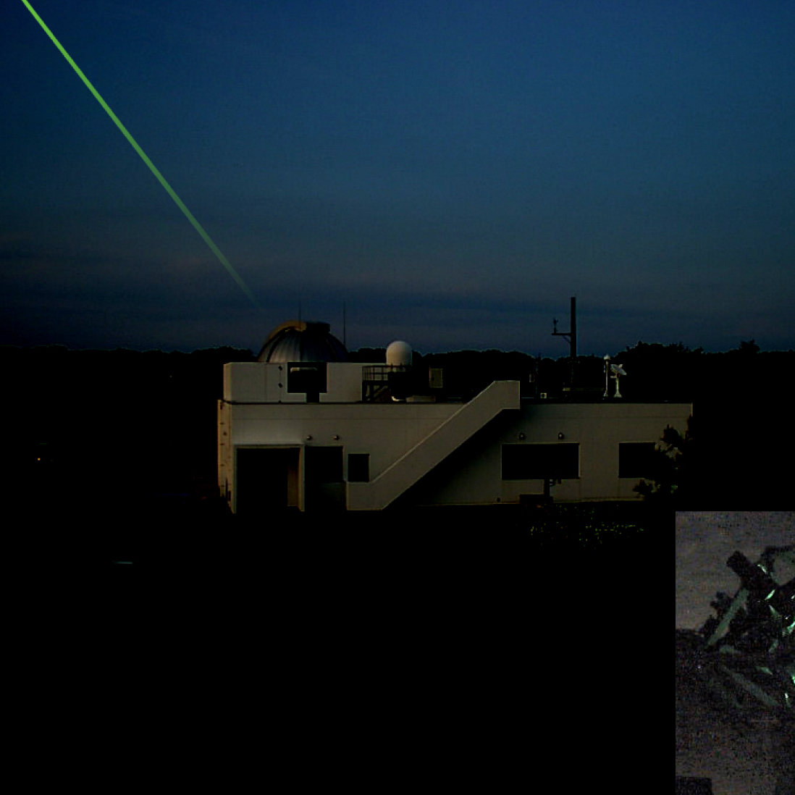
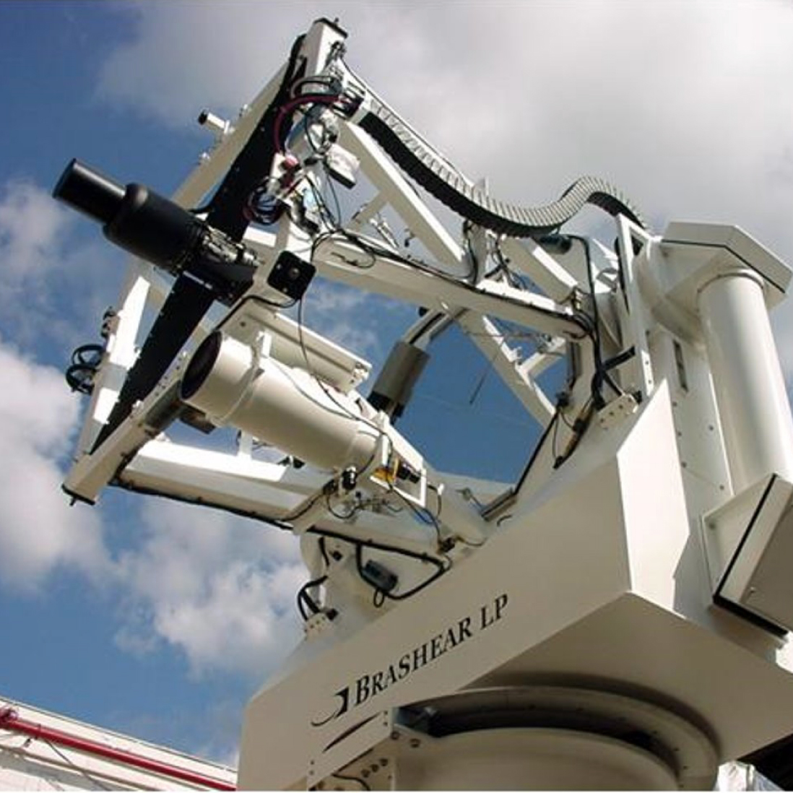

種子島で行われる「Space Art Tanegashima 2024 (種子島宇宙芸術祭)」への出展作品。\
\
本作品は運用を終えたSLRと呼ばれる 、衛星をレーザーで観測する機器の主鏡を利用し、本来とは異なる手法で再び衛星を”感じる”てもらうことを目的としている。

低軌道と呼ばれる地球から近い上空を飛ぶ衛星は現在11,977機。これは101分間の中で0.5秒に1機通過していることになる。この装置から振動が1つ発生している間に、私たちの上空を衛星が1機通過していることになる。
